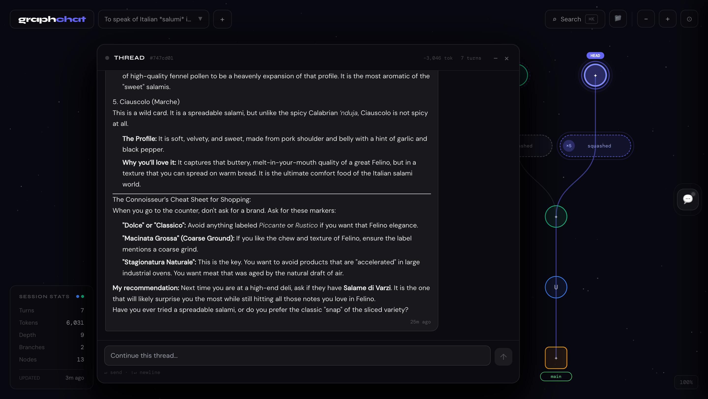

# GraphChat


I have been frustrated with the linear nature of browser-based LLM chatbots. They don't work well when I want to explore multiple sub-topics because the context window eventually gets contaminated. Standard chatbots often lose focus and miss prior instructions as the conversation grows.

Inspired by git architecture, I came up with GraphChat. By treating every conversation turn as an immutable commit, I can visualize, navigate, and branch AI interactions as a zoomable tree. This keeps my context clean and my explorations organized.

---

## Key Features

- **Non-Destructive Branching**: I can click any historical node to branch off. This lets me explore alternate prompts and AI responses without ever losing my original context.
- **Multimodal Attachment Library**: I built a shared library system using IndexedDB. I can upload images, audio, and video once and reuse them across different sessions to minimize storage usage.
- **Dynamic Session Analytics**: The dashboard gives me live stats on turns, multimodal token counts (including resolution-based image estimation), path depth, and leaf-node branch counts.
- **Dialog Minimization Sidebar**: I can minimize up to 5 active dialogs to a sidebar. Hovering over a minimized icon gives me a summary of the latest update, making context switching seamless.
- **LaTeX Overlay Preview**: As I type math formulas, a real-time LaTeX overlay appears to show me exactly how the rendering will look before I send the message.
- **Smart History Squashing**: To keep the graph readable, I automatically squash long linear runs into compact pills. I can still dive into the full history using a dedicated sidebar explorer.
- **In-Memory API Security**: I implemented a dynamic provisioning method for the Gemini API key. It's stored strictly in memory for the duration of the browser session and is never persisted to storage.
- **Atomic Transactional Turns**: User and Assistant messages are committed to the graph atomically only after a successful response, ensuring my conversation tree stays pristine.

---

## Development

I have been prompt-coding this project for the most part with Gemini CLI. I use a curated `GEMINI.md` centered around a 4-D Methodology (Deconstruct, Diagnose, Develop, Deliver). For every request I make, the CLI generates a `REQUEST.md` to digest my intent, a `PROMPTS.md` to refine the LLM instructions, and a `TODO.md` to order the work. You can see the evolution of the project in the aggregated [history/](history) directory. While I have to remind the CLI to stick to the rules occasionally, this workflow has been exceptionally effective for building GraphChat from the ground up.

---

## Getting Started

### Prerequisites

- Node.js (v18+)
- A Gemini API Key (I plan to add support for other providers later)

### Setup

1. **Install dependencies**
   ```bash
   npm install
   ```

2. **Configure Environment (Optional)**
   You can create a `.env.local` file, or simply provide the key through the UI when prompted:
   ```bash
   VITE_LLM_API_KEY=your_api_key_here
   ```

3. **Start Development Server**
   ```bash
   npm run dev
   ```
   Open `http://localhost:5173` in your browser.

---

## Deployment

### Build for Production

To generate a production-ready bundle:

```bash
npm run build
```

The output will be in the `dist/` directory.

### Environment Variables

| Variable | Description |
|----------|-------------|
| `VITE_LLM_API_KEY` | Your LLM API key |

> [!WARNING]
> **Security Note**: This prototype executes API calls directly from the browser. In a production environment, these requests should be proxied through a backend to keep API keys secure.

---

## License

This project is licensed under the [MIT License](LICENSE).
